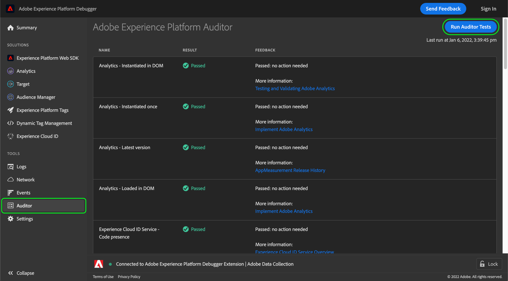

# Pestaña Auditor

En Adobe Experience Platform Debugger, puede utilizar la variable **[!UICONTROL Auditor]** para ejecutar una serie de pruebas de auditoría en la página.

Para usar esta función, haga lo siguiente:

1. Seleccionar **[!UICONTROL Auditor]** en el panel de navegación izquierdo.
1. Seleccione **[!UICONTROL Run Auditor Tests]**. Una vez completadas las pruebas, los resultados aparecen a continuación.

La lista de resultados muestra la prueba y su resultado y proporciona sugerencias para resolver cualquier problema.

## Interpretación de resultados de pruebas

Cada prueba tiene una ponderación y la puntuación de la prueba es igual a la ponderación asignada. Si supera una prueba con una ponderación de 5, recibirá cinco puntos.

| Puntuación | Descripción |
| --- | --- |
| 0 | Advierte de problemas que debe tener en cuenta, pero que no afectan a la puntuación. |
| 1 | Recomienda una optimización. No afecta a la precisión de los datos. |
| 2 | Si no realiza esta prueba, no tendrá acceso a las últimas funciones y correcciones de Adobe Experience Cloud. |
| 3 | Prueba de la eficacia y si la implementación cumple las prácticas recomendadas. |
| 4 | En caso de error, es posible que esté recopilando datos poco fiables. |
| 5 | Error en el que se podrían perder datos. |

Todas las pruebas se superan o no. Comprueban el cumplimiento o el incumplimiento de las condiciones de prueba, por lo que no hay puntuaciones parciales para el cumplimiento parcial. Por ejemplo, si la prueba comprueba la última versión de una solución de Adobe y solo está una versión por detrás, obtendrá la misma puntuación que si estuviera cinco versiones por detrás. Las versiones más recientes incluyen mejoras de rendimiento y correcciones de errores, por lo que se recomienda utilizar la versión más reciente.

Se **recomienda especialmente** corregir cualquier resultado de los niveles 4 o 5.

Se **recomienda** corregir cualquier resultado de los niveles 1 a 3.

## Tecnologías de Adobe compatibles

La función de auditor puede clasificar las siguientes tecnologías de Adobe:

* Adobe Advertising Cloud DSP
* Adobe Advertising Cloud Search
* Adobe Analytics
* Servicio de Adobe Experience Cloud Identity
* Adobe Target
* Etiquetas (anteriormente Adobe Experience Platform Launch)

## Prueba de rúbricas

Para obtener más información sobre los conceptos básicos de prueba que proporciona esta función, consulte los siguientes documentos:

* [Coherencia de etiquetas](./tag-consistency.md)
* [Presencia de etiquetas](./tag-presence.md)
* [Configuración](./configuration.md)
* [Alertas](./alerts.md)
