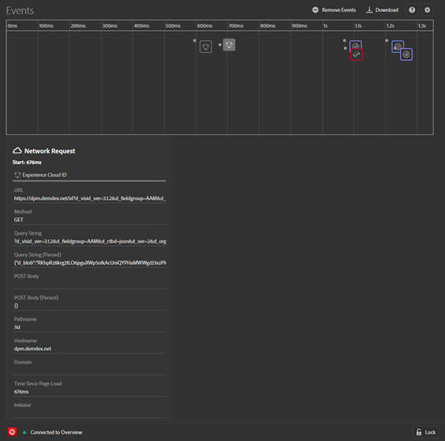

# Eventos{#events}

>[!IMPORTANT]
>
>Adobe Experience Platform Debugger se encuentra en la versión beta. La documentación y las funciones están sujetas a cambios.

La pantalla Eventos proporciona una vista gráfica de los eventos que se producen y que se muestran en una cronología.

Para cada evento, aparece un icono para la solución de aplicable en la cronología. Los iconos también muestran cambios en la capa de datos (si está activada). Pase el ratón sobre un icono para ver un resumen del evento. Haga clic en el evento para obtener más información. Puede pulsar Mayús + clic o Ctrl + clic para ver varios eventos.

Haga clic en un detalle para obtener más información.

## Rastrear cambios en la capa de datos

Para habilitar el seguimiento de los cambios en la capa de datos en la cronología:

1. Haga clic en el icono de engranaje en la parte superior derecha.
1. Introduzca el nombre de la capa de datos.

   

1. Haga clic en **[!UICONTROL Save]**.

Los detalles del cambio de la capa de datos muestran cualquier componente que se haya eliminado o agregado. Puede hacer clic en **{}** para ver más información en la capa de datos.

## Descargar información del evento

Haga clic en **[!UICONTROL Download]** para descargar un archivo de Excel que muestre información sobre las llamadas de página.
